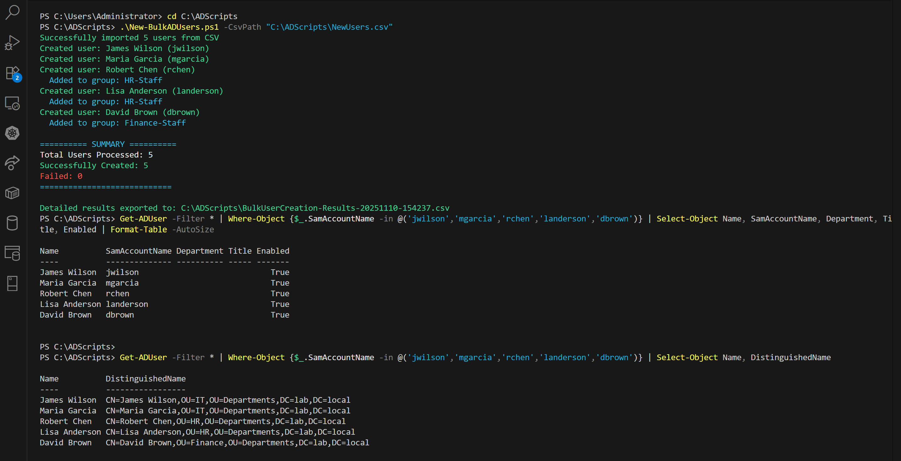
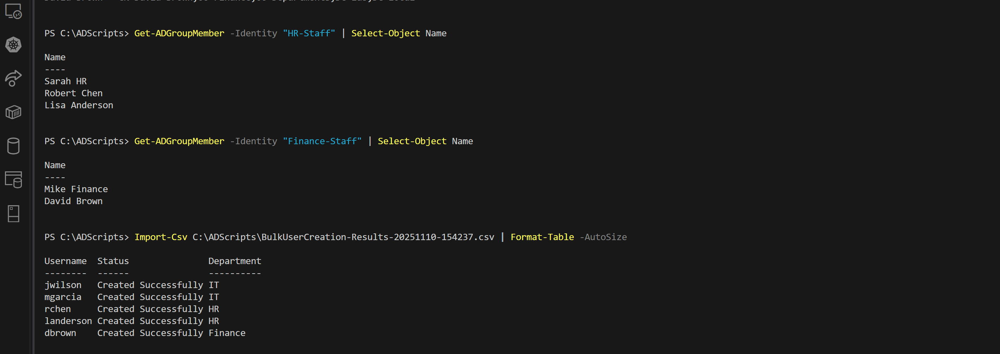

# Bulk AD User Creation Script

## What It Does

Takes a CSV file of new users and creates them all in Active Directory automatically - with proper department OUs, security group assignments, and error handling. No more clicking through AD Users & Computers for 20 minutes per user.

**Key Features:**
- Reads user data from CSV (like HR would provide)
- Automatically puts users in the right department OU
- Adds them to the right security groups
- Handles errors without crashing
- Logs everything for audit trails
- Generates a completion report

## How to Use It

### Basic command:
```powershell
.\New-BulkADUsers.ps1 -CsvPath "C:\ADScripts\NewUsers.csv"
```

### CSV format (what HR would send):
```csv
FirstName,LastName,SamAccountName,Department,Title,Office
James,Wilson,jwilson,IT,Systems Administrator,Building A
Maria,Garcia,mgarcia,IT,Network Engineer,Building A
```

### Custom password:
```powershell
.\New-BulkADUsers.ps1 -CsvPath "C:\ADScripts\NewUsers.csv" -DefaultPassword "***********"
```

## My Test Results

**Lab Environment:**
- Domain: lab.local
- Domain Controller: DC01
- Test: 5 users across IT, HR, and Finance departments

**Results:**
- ✅ All 5 users created successfully
- ✅ Automatically placed in correct OUs
- ✅ Security groups assigned properly
- ✅ No errors

### Screenshot Evidence



## What I Learned

**Mistakes I made:**
- First version used `[switch]` for a boolean parameter - PowerShell threw a type conversion error
- Learned the difference between switch parameters and boolean values
- Fixed it by changing to `[bool]$ChangePasswordAtLogon = $true`

## What's Next

Now that I've got bulk user creation down, I'm building more PowerShell automation scripts:
- Password reset tool for Help Desk scenarios
- AD health check report (finding inactive accounts)
- Group membership auditing
- Eventually: full user lifecycle management (create → modify → disable → delete)

## My Lab Setup

This runs on my home lab:
- Windows Server 2022 Domain Controller
- KVM virtualization on Linux host
- Development workflow: VS Code on Linux → SSH to Windows VM → test scripts
- All documented in GitHub for portfolio

---

**Bottom line:** This shows my ability to  write PowerShell to automate AD tasks, which is exactly what the System Admin IV job requires. I'm not just reading about PowerShell - I'm actually building working automation in a real AD environment.

**Portfolio:** [github.com/rbtgorman/active-directory-lab-portfolio](https://github.com/rbtgorman/active-directory-lab-portfolio)
