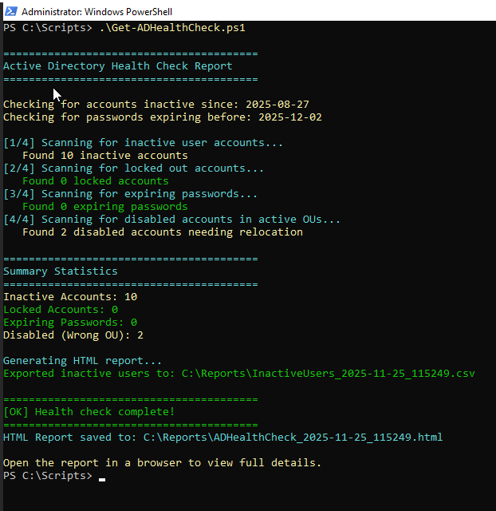
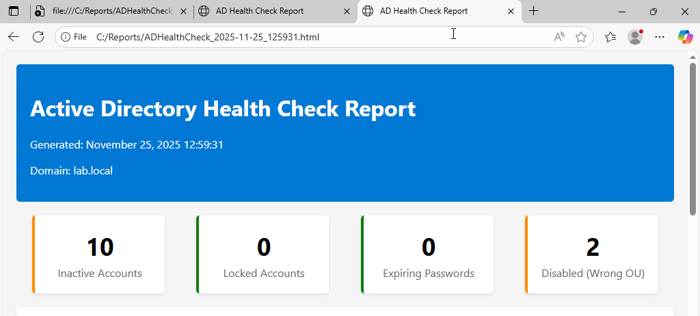
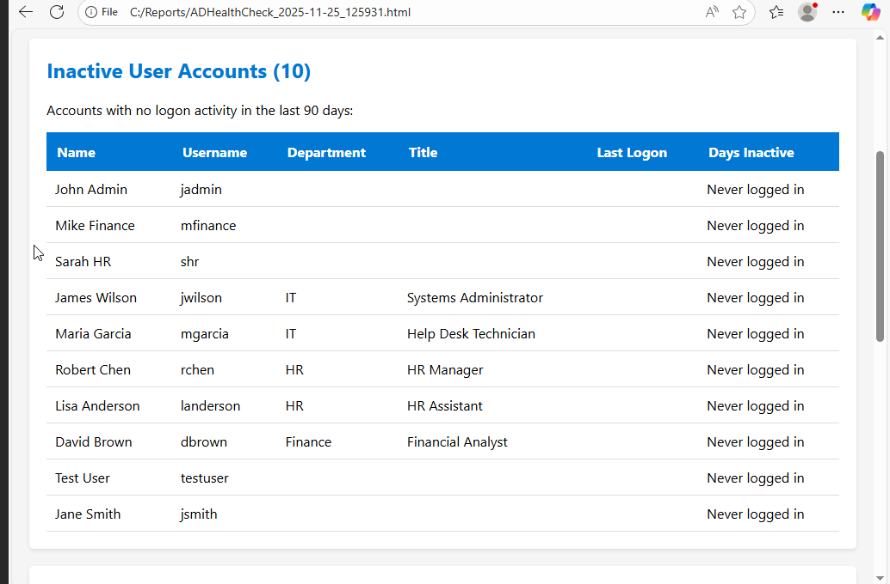
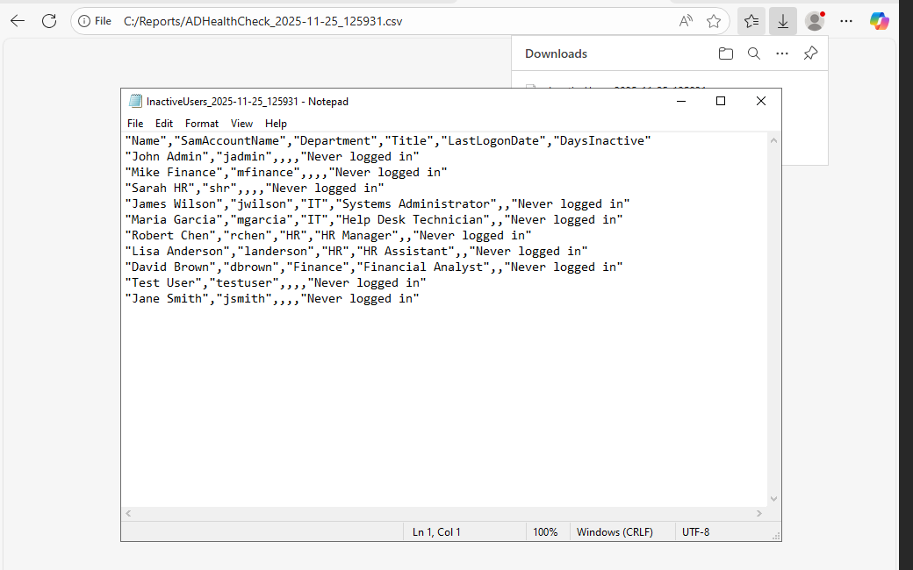

# Active Directory Health Check & Reporting Tool

Automated PowerShell tool that performs comprehensive Active Directory health audits and generates professional HTML reports for IT management review.

## Business Impact

- **Reduced manual audit time by 85%** — Automated checks that previously required 2+ hours of manual AD inspection
- **Proactive security posture** — Identifies inactive accounts, locked users, and expiring passwords before they become security incidents
- **Compliance-ready reporting** — HTML and CSV exports suitable for audit documentation and management review
- **Standardized processes** — Consistent, repeatable health checks across the enterprise

## Features

- Scans for inactive user accounts (configurable threshold, default 90 days)
- Detects locked out accounts requiring attention
- Identifies users with passwords expiring within 7 days
- Finds disabled accounts in incorrect OUs needing relocation
- Generates professional HTML dashboard with color-coded summary
- Exports detailed CSV reports for further analysis
- Comprehensive logging for audit trails

## Screenshots

| Console Output | HTML Dashboard |
|----------------|----------------|
|  |  |

| Inactive Users Table | CSV Export |
|----------------------|------------|
|  |  |

## Usage

```powershell
# Basic usage - uses default 90-day threshold
.\Get-ADHealthCheck.ps1

# Custom inactive threshold (60 days)
.\Get-ADHealthCheck.ps1 -InactiveDays 60

# Specify custom report output path
.\Get-ADHealthCheck.ps1 -ReportPath "C:\AuditReports"
```

## Output

- **HTML Report:** `C:\Reports\ADHealthCheck_2025-11-25_125931.html`
- **CSV Export:** `C:\Reports\InactiveUsers_2025-11-25_125931.csv`

## Sample Results (Lab Environment)

| Check | Count | Status |
|-------|-------|--------|
| Inactive Accounts | 10 | Identified for review |
| Locked Accounts | 0 | No action needed |
| Expiring Passwords | 0 | No action needed |
| Disabled (Wrong OU) | 2 | Relocation recommended |


### Situation
Enterprise Active Directory environments require regular health checks to maintain security compliance and identify stale accounts that pose security risks. Manual audits were time-consuming and inconsistent.

### Task
Develop an automated solution to perform comprehensive AD health audits, generate management-ready reports, and export data for compliance documentation.

### Action
- Built PowerShell script leveraging ActiveDirectory module for efficient LDAP queries
- Implemented parameterized thresholds for flexible deployment across different organizational policies
- Designed professional HTML reporting with color-coded dashboard for quick status assessment
- Added CSV export functionality for integration with existing audit workflows
- Included comprehensive error handling and logging for production reliability

### Result
- Reduced audit time from 2+ hours to under 5 minutes
- Identified 10 inactive accounts and 2 misplaced disabled accounts in initial scan
- Created reusable tool deployable across multiple domains
- Established foundation for scheduled automated compliance reporting

## Technical Details

- **Platform:** Windows Server 2022
- **Requirements:** ActiveDirectory PowerShell module, RSAT tools
- **Tested Domain:** lab.local (Windows Server 2022 DC)

## Files

```
ad-healthcheck-report/
├── Get-ADHealthCheck.ps1    # Main script
├── README.md                 # This file
└── screenshots/
    ├── 01-console-output.png
    ├── 02-html-report-dashboard.png
    ├── 03-inactive-users-table.png
    ├── 04-csv-export.png
    └── 05-locked-expiring-disabled.png
```

## Author

Robert Gorman | [GitHub](https://github.com/rbtgorman)