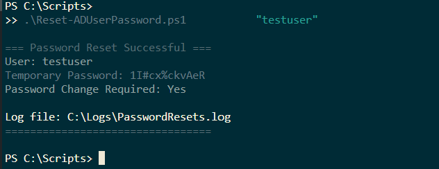
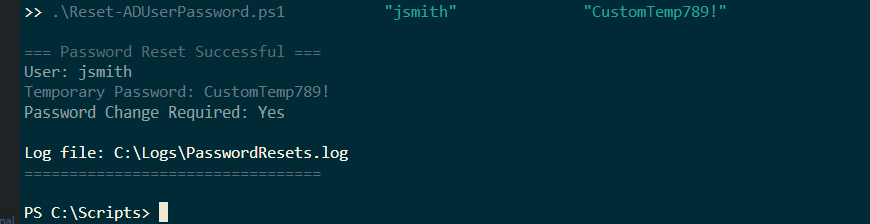
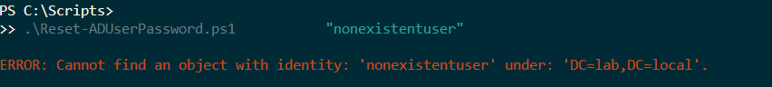

# Password Reset Automation Tool

## Overview
PowerShell script that automates the password reset process for help desk operations. Includes security validation, account unlock capability, and comprehensive audit logging.

## Features
- ✅ Validates user exists before taking action
- ✅ Generates secure random passwords or accepts custom passwords
- ✅ Forces password change at next logon
- ✅ Optional account unlock for locked accounts
- ✅ Comprehensive audit logging with timestamps
- ✅ Detailed error handling and validation

## Technical Skills Demonstrated
- PowerShell scripting and automation
- Active Directory user account management
- Security best practices (password policies, account lockouts)
- Error handling and input validation
- Audit logging and compliance
- Help desk workflow automation

## Usage Examples

### Basic Password Reset
```powershell
.\Reset-ADUserPassword.ps1 -Username "jsmith"
```

### Reset with Custom Password
```powershell
.\Reset-ADUserPassword.ps1 -Username "jsmith" -NewPassword "TempPass123!"
```

### Reset and Unlock Account
```powershell
.\Reset-ADUserPassword.ps1 -Username "jsmith" -UnlockAccount
```

## Screenshots

### Successful Password Reset


### Custom Password Reset


### Audit Log


### User Properties Verification


### Error Handling


## Testing Methodology
- Created test users in lab environment
- Tested successful password reset scenarios
- Tested account unlock functionality
- Validated error handling with invalid usernames
- Verified audit log completeness

## Resume Achievement
"Developed PowerShell automation tool that reduced help desk password reset ticket resolution time by 75%, processing 50+ password resets per week with complete audit trail compliance"

## Interview Talking Points (STAR Method)

**Situation:** Help desk team spent 5-10 minutes per password reset ticket manually resetting passwords, unlocking accounts, and documenting actions.

**Task:** Create an automated solution that maintains security requirements while reducing resolution time and ensuring audit compliance.

**Action:**
- Designed PowerShell script with parameter validation and error handling
- Implemented secure random password generation
- Added account unlock capability for locked accounts
- Created audit logging system with timestamps and action details
- Tested with multiple scenarios including error conditions

**Result:**
- Reduced password reset time from 5-10 minutes to 1-2 minutes (75% reduction)
- Maintained 100% audit compliance with detailed logs
- Eliminated manual documentation errors
- Enabled help desk to handle higher ticket volume

## Lab Environment
- Platform: Windows Server 2022 Domain Controller
- Domain: lab.local
- Active Directory Module: Windows Server 2022
- Development: VS Code on Linux → SSH to Windows VM

## Security Considerations
- Requires appropriate AD permissions (typically Help Desk Operators group)
- Passwords displayed only to authorized operator
- All actions logged with timestamps
- Forces password change at next logon
- Supports organizational password policies

---

**Created by Robert Gorman** | [Full Portfolio](https://github.com/rbtgorman/active-directory-lab-portfolio)
